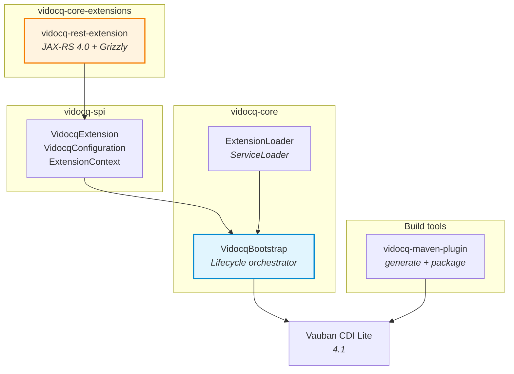

<p align="center">
  
</p>

<h1 align="center">Vidocq</h1>

<p align="center">
  <strong>Serveur MicroProfile Java SE modulaire</strong><br>
  <a href="https://microprofile.io/">MicroProfile 7.1</a> | <a href="https://github.com/VidocqMP/vauban">Vauban CDI Lite</a> | JDK 25 | JPMS
</p>

<p align="center">
  
  
  
  
  
</p>

---

> [English version](README_EN.md)

## Qu'est-ce que Vidocq ?

Vidocq est un serveur d'applications Java SE modulaire construit sur [Vauban](https://github.com/VidocqMP/vauban) (CDI 4.1 Lite). Il implemente progressivement les specifications MicroProfile 7.1 via un systeme d'extensions leger inspire de Quarkus.

### Pourquoi Vidocq ?

| | Quarkus | Helidon | **Vidocq** |
|---|---|---|---|
| CDI | ArC (partiel) | Weld | **Vauban (CDI Lite natif JPMS)** |
| Modules Java | Non | Partiel | **Natif (module-info.java)** |
| Approche | Build-time + extensions | Microframework | **Extensions MicroProfile sur CDI Lite** |
| JDK minimum | 17 | 21 | **25** |

### Philosophie

- **CDI Lite first** : Vauban genere proxies et intercepteurs a la compilation via l'API Class-File du JDK 25
- **Extensions MicroProfile** : chaque spec (REST, Config, Health, ...) est une extension independante
- **JPMS natif** : chaque module declare un `module-info.java`
- **Virtual threads ready** : `ScopedValue` (JEP 487) pour le contexte `@RequestScoped`

## Demarrage rapide

### Prerequis

- JDK 25 (Temurin)
- Maven 4.0.0-rc-5

```bash
# Avec SDKMAN!
sdk env install
```

### Build

```bash
mvn clean install
```

### Hello World REST

```java
@Path("/hello")
public class HelloResource {

    @Inject
    public HelloResource(MyService service) {
        this.service = service;
    }

    @GET
    @Produces(MediaType.TEXT_PLAIN)
    public String hello() {
        return "Hello from Vidocq! " + service.greet();
    }
}
```

Pas besoin de `@RequestScoped` : la `RestScopeExtension` (Build Compatible Extension CDI) l'ajoute automatiquement aux classes `@Path` sans scope explicite.

Point d'entree :

```java
public class App {
    public static void main(String[] args) {
        Vidocq.main(args);
    }
}
```

```bash
$ curl http://localhost:8080/hello
Hello from Vidocq! ...
```

## Architecture



```
vidocq/
├── vidocq-spi                   Interfaces d'extension (VidocqExtension, VidocqConfiguration)
├── vidocq-core                  Bootstrap, decouverte d'extensions, cycle de vie
├── vidocq-maven-plugin          Indexation des beans (vauban-beans.list) + packaging ZIP
├── vidocq-core-extensions/      Extensions MicroProfile 7.1 core
│   └── vidocq-rest-extension    JAX-RS 4.0 via Jersey 4 + Grizzly (bridge CDI/HK2)
└── vidocq-examples/             Exemples
    └── vidocq-rest-example      Application REST d'exemple
```

## Mecanisme d'extensions

Les extensions implementent `VidocqExtension` et sont decouvertes via `ServiceLoader`.

Cycle de vie :

1. **configure** -- configuration avant le boot CDI
2. **beforeStart** -- enrichissement du `VaubanContainerBuilder`
3. **onStart** -- le container CDI est pret, demarrage des services
4. **onStop** -- arret (ordre inverse des priorites)

```java
public class MonExtension implements VidocqExtension {

    @Override
    public String name() { return "mon-extension"; }

    @Override
    public int priority() { return 1000; }

    @Override
    public void onStart(ExtensionContext context) {
        var beanManager = context.beanManager();
    }
}
```

Enregistrement via `META-INF/services/fr.vidocq.vidocq.spi.VidocqExtension` ou `module-info.java` :

```java
provides VidocqExtension with MonExtension;
```

## Extension REST (JAX-RS 4.0)

L'extension REST integre Jersey 4 + Grizzly avec le container CDI Vauban :

| Composant | Role |
|-----------|------|
| `RestExtension` | Extension Vidocq — lifecycle du serveur HTTP |
| `JerseyBridge` | Decouverte `@Path`/`@Provider` via `BeanManager`, factories HK2 delegant a CDI |
| `EmbeddedServer` | Serveur Grizzly avec activation `@RequestScoped` via `ScopedValue` |
| `RestScopeExtension` | BCE ajoutant `@RequestScoped` aux `@Path` sans scope |

### Configuration

| Propriete | Defaut | Description |
|-----------|--------|-------------|
| `vidocq.rest.host` | `0.0.0.0` | Hote d'ecoute |
| `vidocq.rest.port` | `8080` | Port d'ecoute |

### Integration CDI / Jersey

Le bridge CDI-Jersey fonctionne ainsi :

1. Les **classes** `@Path` sont enregistrees dans Jersey pour le routing
2. Des **factories HK2** delegent la creation d'instances au `BeanManager` CDI (`@Any`)
3. Chaque requete HTTP est enveloppee dans `RequestContext.runInScope()` pour activer le contexte CDI `@RequestScoped` (via `ScopedValue` du JDK 25)

## Configuration

Les proprietes sont resolues dans l'ordre :

1. Proprietes systeme (`-Dkey=value`)
2. Variables d'environnement (`KEY_NAME`)
3. Fichier `vidocq.properties` du classpath

## Packaging

```xml
<plugin>
    <groupId>fr.vidocq.vidocq</groupId>
    <artifactId>vidocq-maven-plugin</artifactId>
    <executions>
        <execution>
            <goals>
                <goal>generate</goal>
                <goal>package</goal>
            </goals>
        </execution>
    </executions>
</plugin>
```

Produit une distribution ZIP :

```
myapp-1.0/
  bin/myapp.sh    Lanceur Unix (module-path)
  bin/myapp.cmd   Lanceur Windows
  lib/*.jar       Application + dependances
```

## Extensions MicroProfile 7.1

| Spec | Extension | Status |
|------|-----------|--------|
| JAX-RS 4.0 (REST) | `vidocq-rest-extension` | Done |
| MicroProfile Config | - | Planned |
| MicroProfile Health | - | Planned |
| MicroProfile Metrics | - | Planned |
| MicroProfile OpenAPI | - | Planned |
| MicroProfile JWT Auth | - | Planned |

## Licence

[Apache License 2.0](LICENSE)
