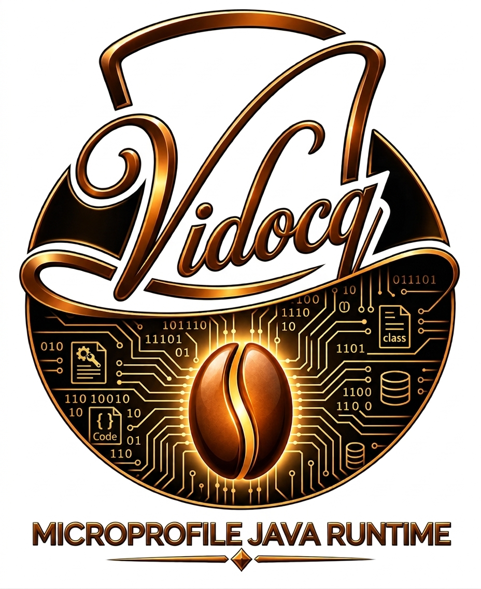
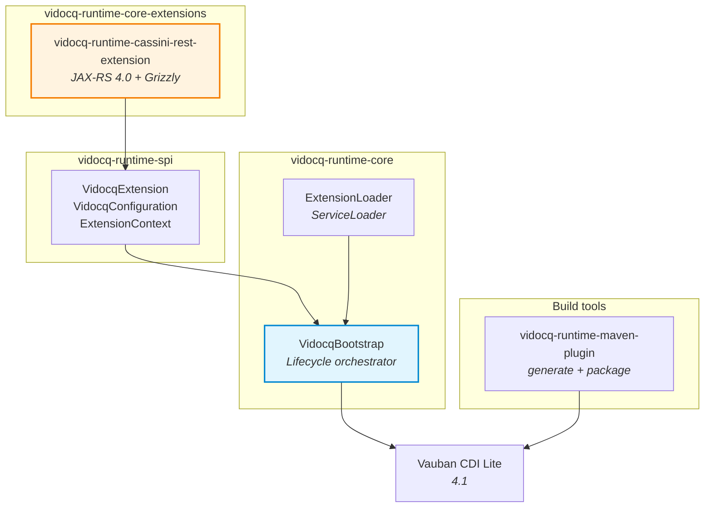

<p align="center">
  
</p>

<h1 align="center">Vidocq</h1>

<p align="center">
  <strong>Modular Java SE MicroProfile Runtime</strong><br>
  <a href="https://microprofile.io/">MicroProfile 7.1</a> | <a href="https://github.com/VidocqMP/vauban">Vauban CDI Lite</a> | JDK 25 | JPMS
</p>

<p align="center">
  
  
  
  
  
</p>

---

## What is Vidocq?

Vidocq is a modular Java SE application runtime built on [Vauban](https://github.com/VidocqMP/vauban) (CDI 4.1 Lite). It progressively implements the MicroProfile 7.1 specifications via a lightweight extension system inspired by Quarkus.

### Why Vidocq?

| | Quarkus | Helidon | **Vidocq** |
|---|---|---|---|
| CDI | ArC (partial) | Weld | **Vauban (native JPMS CDI Lite)** |
| Java Modules | No | Partial | **Native (module-info.java)** |
| Approach | Build-time + extensions | Microframework | **MicroProfile extensions on CDI Lite** |
| Minimum JDK | 17 | 21 | **25** |

### Philosophy

- **CDI Lite first**: Vauban generates proxies and interceptors at compile time via the JDK 25 Class-File API
- **MicroProfile extensions**: each spec (REST, Config, Health, ...) is an independent extension
- **Native JPMS**: each module declares a `module-info.java`
- **Virtual threads ready**: `ScopedValue` (JEP 487) for `@RequestScoped` context

## Quick Start

### Prerequisites

- JDK 25 (Temurin)
- Maven 3.9.16

```bash
# With SDKMAN!
sdk env install
```

### Build

```bash
mvn clean install
```

### Hello World REST

```java
@Path("/hello")
public class HelloResource {

    @Inject
    public HelloResource(MyService service) {
        this.service = service;
    }

    @GET
    @Produces(MediaType.TEXT_PLAIN)
    public String hello() {
        return "Hello from Vidocq! " + service.greet();
    }
}
```

No need for `@RequestScoped`: the `RestScopeExtension` (CDI Build Compatible Extension) adds it automatically to `@Path` classes without an explicit scope.

Entry point:

```java
public class App {
    public static void main(String[] args) {
        Vidocq.main(args);
    }
}
```

```bash
$ curl http://localhost:8080/hello
Hello from Vidocq! ...
```

## Architecture



```
vidocq/
├── vidocq-runtime-spi                   Extension interfaces (VidocqExtension, VidocqConfiguration)
├── vidocq-runtime-core                  Bootstrap, extension discovery, lifecycle
├── vidocq-runtime-maven-plugin          Bean indexing (vauban-beans.list) + ZIP packaging
├── vidocq-runtime-core-extensions/      MicroProfile 7.1 core extensions
│   └── vidocq-runtime-cassini-rest-extension    JAX-RS 4.0 via Jersey 4 + Grizzly (CDI/HK2 bridge)
└── vidocq-runtime-examples/             Examples
    └── vidocq-runtime-cassini-rest-example      Sample REST application
```

## Extension Mechanism

Extensions implement `VidocqExtension` and are discovered via `ServiceLoader`.

Lifecycle:

1. **configure** — configuration before CDI boot
2. **beforeStart** — enrich the `VaubanContainerBuilder`
3. **onStart** — CDI container is ready, start services
4. **onStop** — shutdown (reverse priority order)

```java
public class MyExtension implements VidocqExtension {

    @Override
    public String name() { return "my-extension"; }

    @Override
    public int priority() { return 1000; }

    @Override
    public void onStart(ExtensionContext context) {
        var beanManager = context.beanManager();
    }
}
```

Registration via `META-INF/services/io.vidocq.runtime.spi.VidocqExtension` or `module-info.java`:

```java
provides VidocqExtension with MyExtension;
```

## REST Extension (JAX-RS 4.0)

The REST extension integrates Jersey 4 + Grizzly with the Vauban CDI container:

| Component | Role |
|-----------|------|
| `RestExtension` | Vidocq extension — HTTP server lifecycle |
| `JerseyBridge` | `@Path`/`@Provider` discovery via `BeanManager`, HK2 factories delegating to CDI |
| `EmbeddedServer` | Grizzly server with `@RequestScoped` activation via `ScopedValue` |
| `RestScopeExtension` | BCE adding `@RequestScoped` to `@Path` classes without a scope |

### Configuration

| Property | Default | Description |
|-----------|--------|-------------|
| `vidocq.rest.host` | `0.0.0.0` | Listen host |
| `vidocq.rest.port` | `8080` | Listen port |

### CDI / Jersey Integration

The CDI-Jersey bridge works as follows:

1. `@Path` **classes** are registered in Jersey for routing
2. **HK2 factories** delegate instance creation to the CDI `BeanManager` (`@Any`)
3. Each HTTP request is wrapped in `RequestContext.runInScope()` to activate the CDI `@RequestScoped` context (via JDK 25 `ScopedValue`)

## Configuration

Properties are resolved in order:

1. System properties (`-Dkey=value`)
2. Environment variables (`KEY_NAME`)
3. `vidocq.properties` file on the classpath

## Packaging

```xml
<plugin>
    <groupId>io.vidocq.runtime</groupId>
    <artifactId>vidocq-runtime-maven-plugin</artifactId>
    <executions>
        <execution>
            <goals>
                <goal>generate</goal>
                <goal>package</goal>
            </goals>
        </execution>
    </executions>
</plugin>
```

Produces a ZIP distribution:

```
myapp-1.0/
  bin/myapp.sh    Unix launcher (module-path)
  bin/myapp.cmd   Windows launcher
  lib/*.jar       Application + dependencies
```

## MicroProfile 7.1 Extensions

| Spec | Extension | Status |
|------|-----------|--------|
| JAX-RS 4.0 (REST) | `vidocq-runtime-cassini-rest-extension` | Done |
| Jakarta Servlet 6.1 | `vidocq-servlet-chappe-extension` | Done (~90% TCK) |
| MicroProfile Config | - | Planned |
| MicroProfile Health | - | Planned |
| MicroProfile Metrics | - | Planned |
| MicroProfile OpenAPI | - | Planned |
| MicroProfile JWT Auth | - | Planned |

## Jakarta Servlet 6.1 TCK

The `vidocq-servlet-chappe-extension` is validated against the **official
Jakarta Servlet 6.1 TCK** (Eclipse Foundation), with a current pass rate
of ~90% on the `api.*` packages.

> ⚠️ The TCK runner module is intentionally **outside the main Maven reactor**:
> ShrinkWrap Maven Resolver (transitive dependency of the TCK) cannot parse
> `Model 4.1.0` POMs. Launch it via the dedicated script.

### Prerequisites

The TCK artifacts are not on Maven Central. Install them once:

```bash
curl -Lo /tmp/tck.zip \
  https://download.eclipse.org/jakartaee/servlet/6.1/jakarta-servlet-tck-6.1.0.zip
unzip /tmp/tck.zip -d /tmp/servlet-tck

mvn install:install-file \
  -Dfile=/tmp/servlet-tck/jakarta-servlet-tck/lib/servlet-tck-runtime-6.1.0.jar \
  -DgroupId=jakarta.tck -DartifactId=servlet-tck-runtime -Dversion=6.1.0 -Dpackaging=jar
mvn install:install-file \
  -Dfile=/tmp/servlet-tck/jakarta-servlet-tck/lib/servlet-tck-util-6.1.0.jar \
  -DgroupId=jakarta.tck -DartifactId=servlet-tck-util -Dversion=6.1.0 -Dpackaging=jar
```

### Launch

From the project root:

```bash
./run-official-tck-servlet6.1.sh                     # smoke test
./run-official-tck-servlet6.1.sh --all               # full suite (~10 min)
./run-official-tck-servlet6.1.sh -Dtest=ServletTests # a targeted class
```

The script installs Vidocq modules into the local M2, changes to the
TCK module (ShrinkWrap-compatible cwd), then runs the `tck-official` profile.

Details in [`vidocq-runtime-core-extensions/vidocq-runtime-servlet-chappe-tck-runner/README.md`](vidocq-runtime-core-extensions/vidocq-runtime-servlet-chappe-tck-runner/README.md).

## License

[EPL-2.0 OR EUPL-1.2 OR GPL-2.0-or-later](LICENSE)
